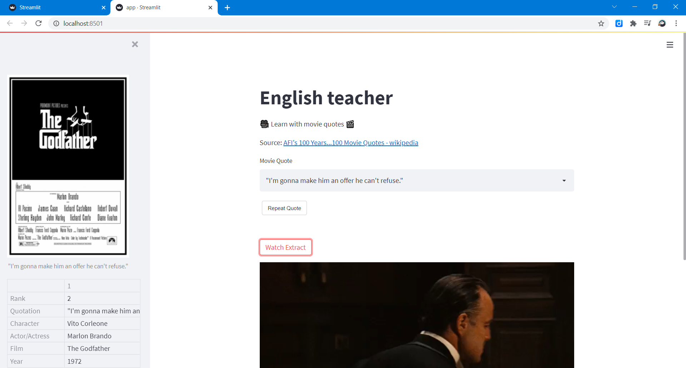
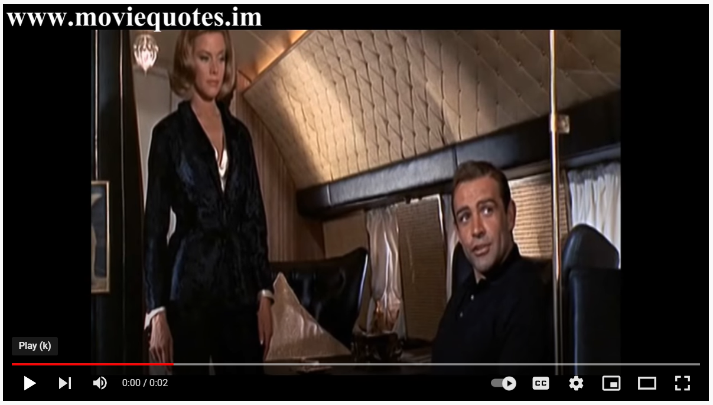

# English teacher web app [](https://share.streamlit.io/slevin48/english/main)
Practice english with movie quotes



## Retrieve movie quotes from Youtube

https://pytube.io/en/latest/user/quickstart.html



    N°90: "A martini. Shaken, not stirred." Goldfinger

https://www.youtube.com/watch?v=UUI65HYqQw0

- Search
```python
from pytube import Search
s = Search(df.Quotation[89] + " " + df.Film[89])
yt89 = s.results[89]
yt89.watch_url
```
- Download from URL
```python
from pytube import YouTube
url = "https://www.youtube.com/watch?v=UUI65HYqQw0"
yt = YouTube(url)
video = yt.streams.first()
video.download('downloads/video_'+str(89))
```

## Speech to Text

Simple version based on CustomJS `webkitSpeechRecognition`


- https://discuss.streamlit.io/t/speech-to-text-on-client-side-using-html5-and-streamlit-bokeh-events/7888

More advanced based on WebRTC
- https://discuss.streamlit.io/t/new-component-streamlit-webrtc-a-new-way-to-deal-with-real-time-media-streams/8669
- https://blog.streamlit.io/how-to-build-the-streamlit-webrtc-component/


## Resources
- https://github.com/mathworks/matlab-with-python/blob/master/mySpeechRecognizer.py
- https://github.com/FinnMcLaughlin/IMDbProject
- https://medium.com/geekculture/end-to-end-movie-recommendation-system-49b29a8b57ac